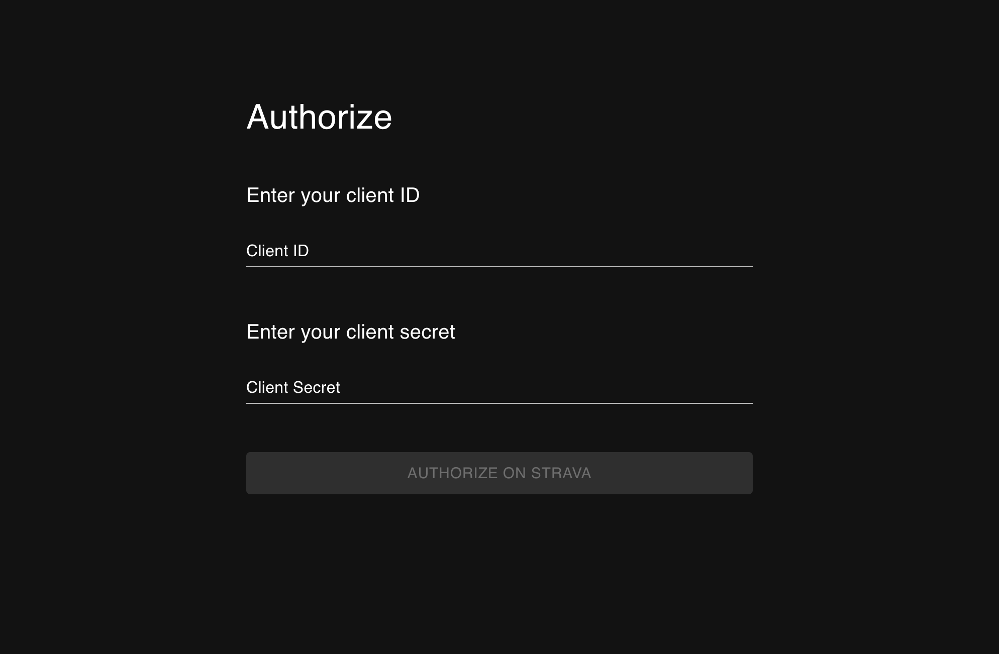
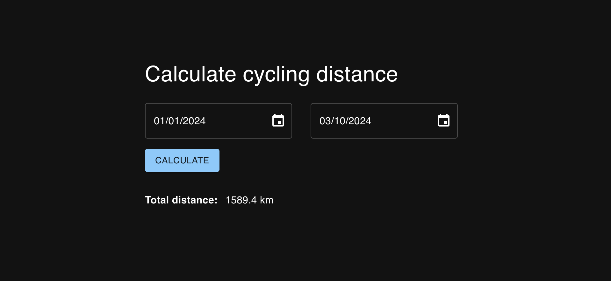

# Calculate a distance based on a start/end date for strava activities

I found that Strava lacked functionality for easily calculating the distance between specific dates, which is useful for comparing activities year over year. To address this, I took the following steps:

1. Authorized access to the Strava API via OAuth2.
2. Created a backend proxy to aggregate all necessary data.
3. Developed a frontend interface for user interaction.
4. Containerized both applications using Docker and orchestrated their execution together

### Note: The current implementation only filters for cycling activities.

## Run the application
1. Start the backend on Port:8000 `yarn start`
2. Start the frontend on Port: 3000 `yarn start`
3. (Optional )Build the docker images with `docker-compose up --build`

## Screenshots

